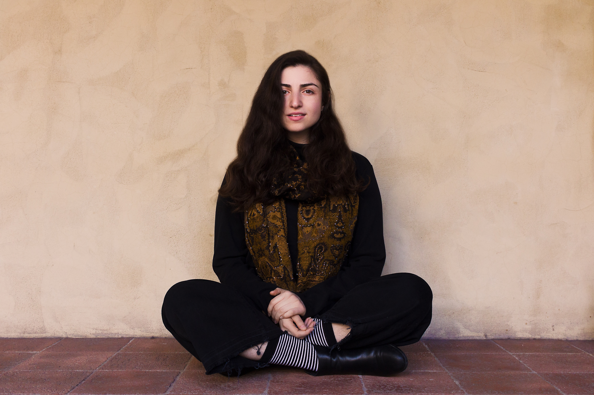

[home](/)&nbsp;&nbsp;&nbsp;&nbsp; [about](/about.html)&nbsp;&nbsp;&nbsp;&nbsp; [calendar](/calendar.html)&nbsp;&nbsp;&nbsp;&nbsp; [media](/media.html)&nbsp;&nbsp;&nbsp;&nbsp; [contact](/contact.html)

 
Photo by Nuna Ulises

The soprano Raha Mirzadegan is a Persian-American musician based in New York. A lover of sacred music and polyphony, her repertoire spans the medieval chant of Hildegard von Bingen to premieres of new works by living composers. In spring of 2022, Raha was a guest artist at Spoleto Festival USA, where she made her operatic stage debut with "stylish elegance and intensity" (Wall Street Journal) as the featured soprano in the world premiere of Unholy Wars—a baroque pastiche created by Karim Sulayman. Acclaimed for her "stirring, soulful tones" (The Post & Courier), this season Raha will again join The Clarion Choir for performances in New York City, and on tour with The English Concert and Harry Bicket. In November of 2022, she performed her first Messiah as soprano soloist with the Atlanta Baroque Orchestra. This fall, Raha performed as Guinevere in Doug Balliett's Gawain and the Green Knight, and with The Clarion Choir in their performances and subsequent recording of Rachmaninoff's Liturgy of St. John Chrysostom. In October, she and her duo partner, Sarah Young, premiered Songs from Wild Earth for voice and flute by Eric Pazdziora. This February, Raha will join Theotokos for a performance of Marc-Antoine Charpentier's Leçons de ténèbres du Mercredi Saint (H. 96-98). Raha studied voice with Gran Wilson at the University of Maryland.

