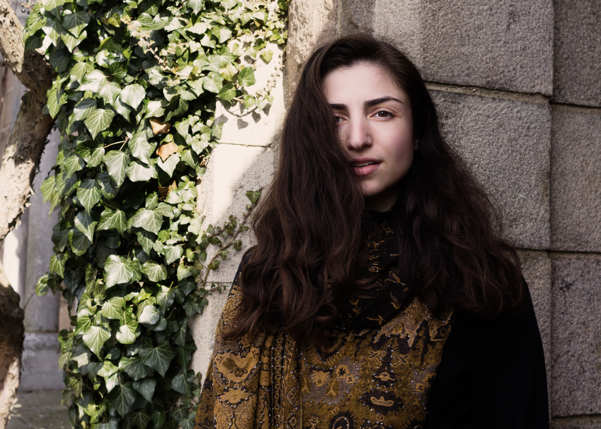

[home](/)&nbsp;&nbsp;&nbsp;&nbsp; [about](/about)&nbsp;&nbsp;&nbsp;&nbsp; [calendar](/calendar)&nbsp;&nbsp;&nbsp;&nbsp; [media](/media)&nbsp;&nbsp;&nbsp;&nbsp; [contact](/contact)

 
Photo by Nuna Ulises

"You should all be fighting for a chance to hear soprano Raha Mirzadegan, whose straight tone soars with opulent richness and resonance." (<i>All Ears</i>) 
 
  
Praised for her “stylish elegance and intensity” (<i>The Wall Street Journal</i>), “rising-star soprano” (<i>OperaWire</i>) Raha Mirzadegan is garnering international attention for her “stirring, soulful tones” (<i>The Post & Courier</i>). With a repertoire that spans medieval chant to cutting-edge premieres, Raha is known for her “straight tone [which] soars with opulent richness and resonance” (<i>All Ears</i>).
 
 
“Totally at ease in the Baroque style” (<i>Seen and Heard International</i>), Raha began the 2023-24 season debuting at Opera Philadelphia as the featured soprano in Karim Sulayman’s Baroque pastiche <i>Unholy Wars</i>, a role she originated at Spoleto Festival USA. An avid performer of new works, Raha will appear as Guinevere on the forthcoming premiere recording of Doug Balliett’s opera </i>Gawain and the Green Knight</i>, a role she has reprised in the annual New Year’s Eve performance of the piece. Other premieres and records include music by Mary Kouyoumdjian, Owen Burdick, Elliot Cole, and Eric Pazdziora.
 
 
A devotee of sacred music, Raha was a soloist on The Clarion Choir’s GRAMMY®-nominated recording of Rachmaninoff’s <i>All-Night Vigil</i> (Pentatone, 2023), and regularly performs with Theotokos, a period-instrument band of Juilliard students and alumni. In October 2023, Raha performed the lead in a workshop of <i>DRIFT</i>, an opera by Alyssa Weinberg and J. Mae Barizo. To close the 23-24 season, Raha was a standout soloist with Clarion, in their <i>Ockeghem Marathon</i> and concert at The Met Cloisters.
 
 
This winter, Raha will spend time in Thiré, performing Balliett’s newest works with members of Theotokos, as part of the French Ministry of Culture’s Odysée artist-in-residency program, hosted by William Christie and Les Arts Florissants. Based in New York, Raha earned a BM in Vocal Performance from the University of Maryland, where she studied with Gran Wilson.

