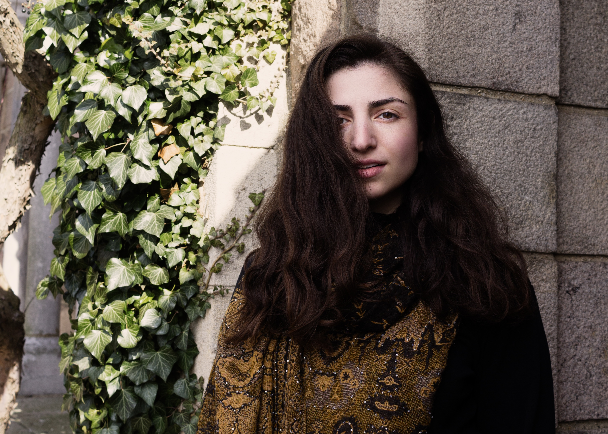
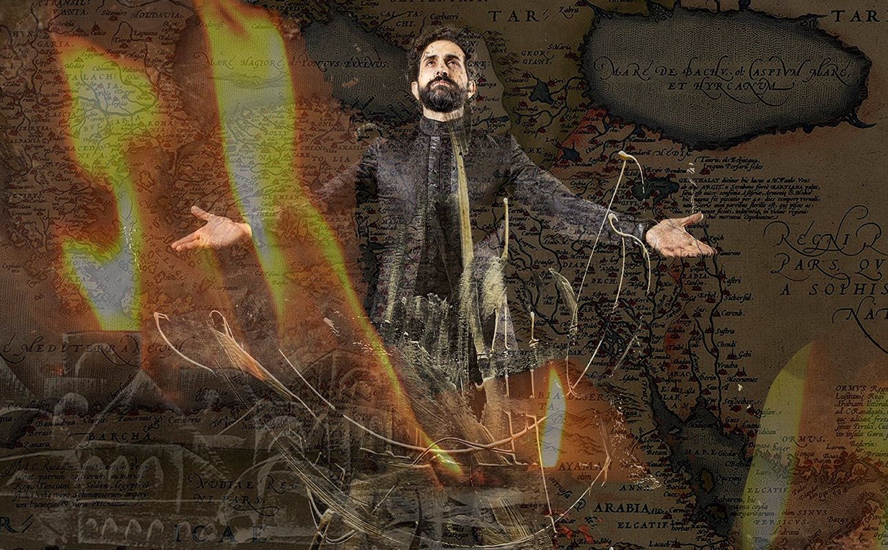
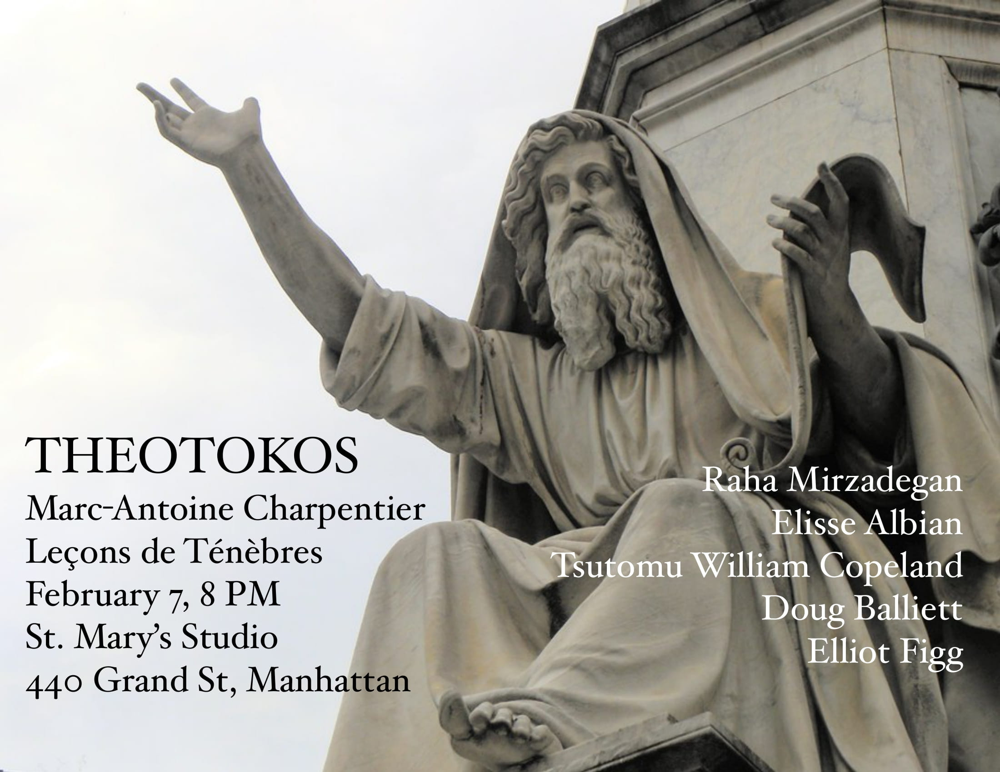

[home](/)&nbsp;&nbsp;&nbsp;&nbsp; [about](/about)&nbsp;&nbsp;&nbsp;&nbsp; [calendar](/calendar)&nbsp;&nbsp;&nbsp;&nbsp; [media](/media)&nbsp;&nbsp;&nbsp;&nbsp; [contact](/contact)
 
Photo by Nuna Ulises
 
 
NEXT UP:
 
 
<b>February:</b> French Ministry of Culture’s Odysée artist-in-residency program, with <b>Theotokos</b>, hosted by William Christie and <b>Les Arts Florissants</b>
 
 
<b>March:</b> Soloist in New York Premiere of Doug Balliett's <i>St. Mark Passion</i>
 
 
<b>March:</b> Soloist in <i>Messiah</i> with <b>Hudson Baroque</b>
 
 
<b>April:</b> Soloist in Bach's <i>St. John Passion</i> with <b>Clarion</b>
 
 
<b>April/May:</b> House and role debut as Sesto in <i>Giulio Cesare</i> with <b>Ruckus</b> at Hudson Hall, directed by R.B. Schlather
 
<iframe width="100%" height="236" src="https://www.youtube.com/embed/4wEbXnwlaMo?si=CAQd-PcvvcPtxMAY" title="YouTube video player" frameborder="0" allow="accelerometer; autoplay; clipboard-write; encrypted-media; gyroscope; picture-in-picture; web-share" referrerpolicy="strict-origin-when-cross-origin" allowfullscreen></iframe>
 
 
Recent engagements:
 
 
29 May, 1, 3 & 6 June 2022 
<b>Unholy Wars (world premiere)</b> 
Spoleto Festival USA 
Dock Street Theatre, Charleston, SC 

An original multidisciplinary production stitching together music of the Italian Baroque centering around the Crusades, conceived and performed by Karim Sulayman

Karim Sulayman, tenor 
Raha Mirzadegan, soprano 
John Taylor Ward, bass-baritone 
Coral Dolphin, dancer 

Kevin Newbury, stage direction 
Julie Andrijeski, music direction 
Ebony Williams, choreography 
Kevork Mourad, visual design 
David C. Woolard, costume design 
Jennifer Fok, lighting design 

with original interstitial music composed by Mary Kouyoumdjian

 
7 February 2023 
THEOTOKOS 
<b>Charpentier: Leçons de ténèbres</b> 
St. Mary's Studio, Manhattan, NY 

Raha Mirzadegan, soprano 
Elisse Albian, soprano 
Tsutomu William Copeland, violin 
Doug Balliett, viola da gamba 
Elliot Figg, harpsichord 

<a href="https://www.universe.com/theotokos">More info</a>

<a href="https://spoletousa.org/events/unholy-wars/">More info</a>

23, 27, 30 September, & 1 October 2023 
<b>Unholy Wars</b> 
Opera Philadelphia Premiere 
Part of Festival O23 

<a href="https://www.operaphila.org/whats-on/in-theaters-2023-2024/unholy-wars">More info</a>

26-30 October 2023 
<b>DRIFT: An Opera in Three Acts</b> 
New Opera Workshop @ Opera America 

DRIFT is a story of motherhood, migration and climate change, exploring the forces that drive families from their homes into the uncertain refuge of new lands. Braiding an intimate narrative between Esmeralda and her childhood friend, James, DRIFT opens in a glacial landscape scarred by ecological disaster. Swinging between the domestic and the surreal, the second act returns to the terminal green of the characters’ youths as they navigate in a toxic-laden panorama of swamplands and power plants. An intersectional portrait of identity, DRIFT necessitates a radically new examination of motherlands, geography and memory. 

Original story and libretto by J. Mae Barizo, and music by Alyssa Weinberg. Currently under development, supported by Opera America’s Discovery Grant program and made possible by the Virginia B. Toulmin Foundation. DRIFT is actively looking for additional support and welcomes interest from co-commissioners and presenters.

12 November 2023 
<b>Soloist with Theotokos and special guest William Christie of <i>Les Arts Florissants</i></b> 

19 November 2023 
<b>Les chevelures voice-piano recital</b> 
Raha Mirzadegan, soprano 
Sarah Young, piano 
Stone Ridge, New York 

7 December 2023 
<b>Cantatas: Yesterday and Today</b> 
Music of Telemann and Balliett 
Presented by Five Buroughs Music Festival 
THEOTOKOS 
St. Mary's Grand Street, NYC

RAHA MIRZADEGAN, soprano 
LEIKEN, tenor 
WILL COPELAND, violin 
CLAY ZELLER-TOWNSON, bassoon 
KELSEY BURNHAM, flute 
DOUG BALLIETT, viola da gamba 
ELLIOT FIGG, harpsichord 

Theotokos performs old and new sacred music, linking the liturgical traditions of the Baroque with contemporary compositional voices.

<a href="https://5bmf.org/events/theotokos/">More info</a>

31 December 2023 
<b>Gawain and the Green Knight</b> 
A Medieval New Year's Legend 
by Doug Balliett 
Raha reprises the role of Guinevere 
New York City

Performed by Elisse Albian, Jesse Blumberg, Taylor Ward, Jonathan Woody, Karim Sulayman, Elisa Sutherland, Raha Mirzadegan, members of ACRONYM, Ruckus, AMOC, and more.

Gawain and the Green Knight: a Christmas story, a horror story, a romance, a paean to nature. All set at King Arthur’s court which huddles in its luxury on the borders of unforgiving wilderness and forces unknown. Gawain has agreed to have his head chopped off in a year’s time. But why? And can he live up to his promise, or his legendary perfection?

1-4 January 2024 
<b>Gawain and the Green Knight studio recording</b> 
Oktaven Studios

18 February 2024 
<b>Les chevelures voice-piano recital</b> 
Raha Mirzadegan, soprano 
Sarah Young, piano 
Stone Ridge, New York 

Mark your calendars for 4 o’clock on February 18th, for an hour-long concert featuring works by Fauré, Debussy, Ravel, Britten, Purcell, and Vaughan Williams, followed by a reception with delicious food offerings.

Raha Mirzadegan and Sarah Young return to Stone Ridge, New York for their second recital as the voice-piano duo Les Chevelures. The two began their friendship and musical collaboration while undergraduate students at the University of Maryland, College Park. They are thrilled to be back to share this music with the wonderful community at CTK, Stone Ridge.

28 March 2024 
<b>Marenzio: Salve Regina</b> 
Theotokos, Midtown Concerts 

Elisse Albian ~ soprano 
Raha Mirzadegan ~ soprano 
Elisa Sutherland ~ alto 
leiken ~ tenor 
Emery Kerekes ~ bass 
Doug Balliett ~ viol & director 
Elliot Figg ~ organ 

<a href="https://gemsny.org/current-season/117-midtown-concerts/2023-2024-season/990-mar-28-2024">More info</a>

1 May 2024 
<b>J.S. BACH: MASS IN B MINOR</b> 
Clarion

<a href="https://clarionsociety.org/events/2023-24-season/bachmass.html">More info</a>

12 June 2024 
<b>OCKEGHEM MARATHON AT THE MET CLOISTERS</b> 

Over a period of five hours, the different instrumental and vocal consorts from The Clarion Choir and The Clarion Orchestra will explore the works of Johannes Ockeghem in various parts of the Cloisters, including the Romanesque Hall, Cuxa Cloister, Langon Chapel, and Saint Guilhem Cloister. Ockeghem was one of the most influential early Renaissance composers and an important proponent of the Franco-Flemish School. After looking at his earlier and middle period works with smaller ensembles throughout the day, the Clarion singers and players will come together for a final concert of his later works from 7-8pm in the glorious Fuentidueña Chapel.

<a href="https://clarionsociety.org/events/2023-24-season/cloisters.html">More info</a>
